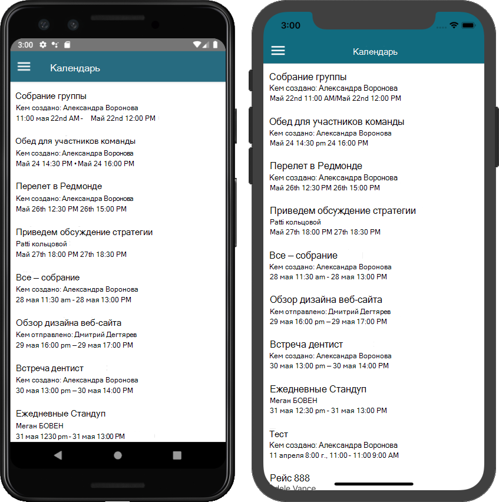

<!-- markdownlint-disable MD002 MD041 -->

В этом упражнении вы добавите Microsoft Graph в приложение. Для этого приложения вы будете использовать [клиентскую библиотеку JavaScript для Microsoft Graph](https://github.com/microsoftgraph/msgraph-sdk-javascript) , чтобы совершать вызовы в Microsoft Graph.

## <a name="get-calendar-events-from-outlook"></a>Получение событий календаря из Outlook

В этом разделе `GraphManager` описывается расширение класса для добавления функции для получения событий пользователя текущей недели и обновления `CalendarScreen` для использования этих новых функций.

1. Откройте файл **графтуториал/Graph/графманажер. Целевой** файл и добавьте указанный ниже метод в `GraphManager` класс.

    :::code language="typescript" source="../demo/GraphTutorial/graph/GraphManager.ts" id="GetCalendarViewSnippet":::

    > [!NOTE]
    > Рассмотрите, какие действия `getCalendarView` выполняет код.
    >
    > - URL-адрес, который будет вызываться — это `/v1.0/me/calendarView` .
    > - `header`Функция добавляет `Prefer: outlook.timezone` заголовок в запрос, что приводит к тому, что время в отклике будет в предпочтительном часовом поясе пользователя.
    > - `query`Функция добавляет `startDateTime` `endDateTime` Параметры и определяет окно представления календаря.
    > - `select`Функция ограничит поля, возвращаемые для каждого события, только теми, которые приложение будет использовать в действительности.
    > - `orderby`Функция сортирует результаты по времени начала.
    > - `top`Функция ограничит результаты первыми событиями 50.

1. Откройте **графтуториал/views/календарскрин. Целевой** элемент и замените все его содержимое приведенным ниже кодом.

    ```typescript
    import React from 'react';
    import {
      ActivityIndicator,
      Alert,
      FlatList,
      Modal,
      Platform,
      ScrollView,
      StyleSheet,
      Text,
      View,
    } from 'react-native';
    import { createStackNavigator } from '@react-navigation/stack';
    import * as MicrosoftGraph from '@microsoft/microsoft-graph-types';
    import moment from 'moment-timezone';
    import { findOneIana } from 'windows-iana';

    import { UserContext } from '../UserContext';
    import { GraphManager } from '../graph/GraphManager';

    const Stack = createStackNavigator();
    const CalendarState = React.createContext<CalendarScreenState>({
      loadingEvents: true,
      events: []
    });

    type CalendarScreenState = {
      loadingEvents: boolean;
      events: MicrosoftGraph.Event[];
    }

    // Temporary JSON view
    const CalendarComponent = () => {
      const calendarState = React.useContext(CalendarState);

      return (
        <View style={styles.container}>
          <Modal visible={calendarState.loadingEvents}>
            <View style={styles.loading}>
              <ActivityIndicator
                color={Platform.OS === 'android' ? '#276b80' : undefined}
                animating={calendarState.loadingEvents}
                size='large' />
            </View>
          </Modal>
          <ScrollView>
            <Text>{JSON.stringify(calendarState.events, null, 2)}</Text>
          </ScrollView>
        </View>
      );
    }

    export default class CalendarScreen extends React.Component {
      static contextType = UserContext;

      state: CalendarScreenState = {
        loadingEvents: true,
        events: []
      };

      async componentDidMount() {
        try {
          const tz = this.context.userTimeZone || 'UTC';
          // Convert user's Windows time zone ("Pacific Standard Time")
          // to IANA format ("America/Los_Angeles")
          // Moment.js needs IANA format
          const ianaTimeZone = findOneIana(tz);

          // Get midnight on the start of the current week in the user's
          // time zone, but in UTC. For example, for PST, the time value
          // would be 07:00:00Z
          const startOfWeek = moment
            .tz(ianaTimeZone!.valueOf())
            .startOf('week')
            .utc();

          const endOfWeek = moment(startOfWeek)
            .add(7, 'day');

          const events = await GraphManager.getCalendarView(
            startOfWeek.format(),
            endOfWeek.format(),
            tz);

          this.setState({
            loadingEvents: false,
            events: events.value
          });
        } catch(error) {
          Alert.alert(
            'Error getting events',
            JSON.stringify(error),
            [
              {
                text: 'OK'
              }
            ],
            { cancelable: false }
          );

        }
      }

      render() {
        return (
          <CalendarState.Provider value={this.state}>
            <Stack.Navigator>
              <Stack.Screen name='Calendar'
                component={ CalendarComponent }
                options={{
                  headerShown: false
                }} />
            </Stack.Navigator>
          </CalendarState.Provider>
        );
      }
    }

    const styles = StyleSheet.create({
      container: {
        flex: 1
      },
      loading: {
        flex: 1,
        justifyContent: 'center',
        alignItems: 'center'
      },
      eventItem: {
        padding: 10
      },
      eventSubject: {
        fontWeight: '700',
        fontSize: 18
      },
      eventOrganizer: {
        fontWeight: '200'
      },
      eventDuration: {
        fontWeight: '200'
      }
    });
    ```

Теперь вы можете запустить приложение, войти и нажать в меню элемент Навигация по **календарю** . В приложении должен появиться дамп JSON событий.

## <a name="display-the-results"></a>Отображение результатов

Теперь вы можете заменить дамп JSON на какой-то способ отобразить результаты в удобном для пользователя виде. В этом разделе мы покажем, как добавить элемент в `FlatList` экран календаря для отображения событий.

1. Добавьте приведенный ниже **above** метод над `CalendarScreen` объявлением класса.

    :::code language="typescript" source="../demo/GraphTutorial/screens/CalendarScreen.tsx" id="ConvertDateSnippet":::

1. Замените `ScrollView` в `CalendarComponent` методе приведенный ниже метод.

    ```typescript
    <FlatList data={calendarState.events}
      renderItem={({item}) =>
        <View style={styles.eventItem}>
          <Text style={styles.eventSubject}>{item.subject}</Text>
          <Text style={styles.eventOrganizer}>{item.organizer.emailAddress.name}</Text>
          <Text style={styles.eventDuration}>
            {convertDateTime(item.start.dateTime)} - {convertDateTime(item.end.dateTime)}
          </Text>
        </View>
      } />
    ```

1. Запустите приложение, войдите в систему и нажмите элемент навигации по **календарю** . Вы должны увидеть список событий.

    
