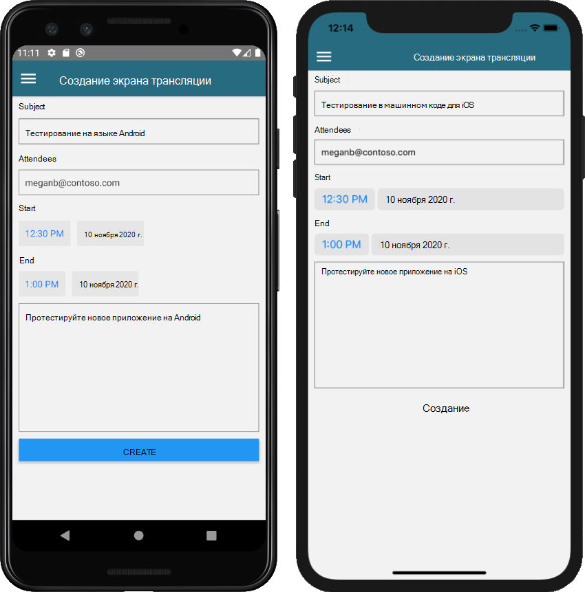

<!-- markdownlint-disable MD002 MD041 -->

В этом разделе мы добавим возможность создания событий в календаре пользователя.

## <a name="create-the-new-event-screen"></a>Создание экрана создания события

1. Откройте **./граф/графманажер.ТС** и добавьте в класс следующую функцию `GraphManager` .

    :::code language="typescript" source="../demo/GraphTutorial/graph/GraphManager.ts" id="CreateEventSnippet":::

    Эта функция использует Graph SDK для создания нового события.

1. Создайте новый файл в файле **./СКРИНС** с именем **невевентскрин. целевого сервера** и добавьте следующий код.

    :::code language="typescript" source="../demo/GraphTutorial/screens/NewEventScreen.tsx" id="NewEventScreenSnippet":::

    Определите, что `createEvent` делает функция. Он создает `MicrosoftGraph.Event` объект, используя значения из формы, а затем передает этот объект в `GraphManager.createEvent` функцию.

1. Откройте **./менус/дравермену.тскс** и добавьте приведенный ниже `import` оператор в начало файла.

    ```typescript
    import NewEventScreen from '../screens/NewEventScreen';
    ```

1. Добавьте следующий код внутри `<Drawer.Navigator>` элемента непосредственно над `</Drawer.Navigator>` строкой.

    ```typescript
    { userLoaded &&
      <Drawer.Screen name='NewEvent'
        component={NewEventScreen}
        options={{drawerLabel: 'New event'}} />
    }
    ```

1. Сохраните изменения и перезапустите или обновите приложение. В меню выберите пункт **создать событие** , чтобы открыть форму создать событие.

1. Заполните форму и выберите **создать**.

    
